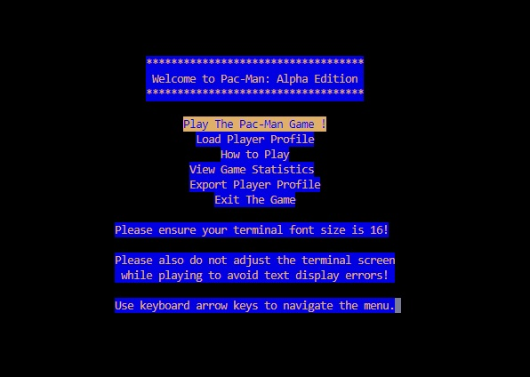

# Pac-Man: Alpha Edition
ENGG1340 Final Group Project - Group 68


## Table of Contents

- [Pac-Man: Alpha Edition](#pac-man-alpha-edition)
  - [Table of Contents](#table-of-contents)
  - [Group Members](#group-members)
  - [About the Game](#about-the-game)
    - [Game Description](#game-description)
    - [Game Rules](#game-rules)
  - [Features Implemented](#features-implemented)
    - [Generation of random game sets or events](#generation-of-random-game-sets-or-events)
    - [Data structures for storing game status](#data-structures-for-storing-game-status)
    - [Dynamic memory management](#dynamic-memory-management)
    - [File input/output](#file-inputoutput)
    - [Program codes in multiple files](#program-codes-in-multiple-files)
  - [Non-Standard Libraries Used](#non-standard-libraries-used)
    - [NCurses](#ncurses)
  - [Compilation and Execution Instructions](#compilation-and-execution-instructions)

<a href="#top">Back to top</a>

<br>

## Group Members
|  Name  |  UID  |  GitHub Username  |
| :------------:  |  :------------: |  :------------: |
|  **Fong Ting Hin**  |  3036068802  | FongTingHin
|  **Lok Wang Yi**  |  3036067420  | lokwy-hku
|  **Lui Yik Hang**  |  3036067652  | felixlyh
|  **Widjaja Edward Aryaguna**  |  3036029703  | W-Edward
|  **Wong Hoi Lei**  |  3036063917  | ginngerine

[Back to Table of Contents](#table-of-contents)

<br>

##  About the Game
Pac-Man was a trending video game in the 1980s. Taking inspiration from it, we decided to bring back it back with in a text-based yet arcade-style form for users to relive their greatest memories.

###  Game Description
Pac-Man, a video game that originated in the 1980s, was once extremely popular across the globe. The game design was intended to be a harmonious-themed arcade game suitable for gamers of all genders. This helped Pac-Man stand out amongst other video games from its era since most computer games were strongly male-oriented, since the majority of people involved with information technology were men.

In the game, the four ghosts Blinky, Pinky, Inky and Clyde have different pathfinding algorithms designed to chase down Pacman in different ways. To further enhance the game, ghosts can engage in different modes that allow the player to engage with them differently.

| Ghost Mode | Ghost Behaviour | Impact Upon Collision |
| :------------:  |  :------------: |  :------------: |
| Chase Mode | The ghost chases Pacman based on its location and their respective algorithms | Pacman dies upon collision|
| Scatter Mode | The ghosts targets their respective corner of the map, thus giving up the chase on Pacman | Pacman dies upon collision |
| Frightened Mode | The ghost moves around the map randomly | Ghost is consumed and enters Eaten Mode upon collision |
| Eaten Mode | The ghost returns to the ghost house after being consumed | No interaction upon collision |

<br>

In order to win the game, players can consume fruits, power pellets and frightened ghosts to gain points. The map is renewed once all fruits and pellets are consumed while the score is kept.

| Item | Points Awarded |
| :------------:  |  :------------: |
| Fruit | 20 |
| Power Pellet | 100 |
| Frightened Ghost | 300 |

###  Game Rules

1. In the map, Pacman spawns along with 4 ghosts, Blinky, Pinky, Inky and Clyde, which attempt to eat it. The player should evade the ghosts as Pacman by controlling its movement pattern.

2. Pacman may collect a power pellet (`||`) which allows it to eat the ghosts and return the ghosts to the ghost house. Ghosts can only be consumed by Pacman when they are in frightened mode.

3. To increase the game score, Pacman should consume fruits (`''`), power pellets (`||`), and ghosts in frightened mode, which can be found along different paths in the map.

4. Once Pacman has been damaged 3 times by the ghosts, the game will conclude.

[Back to Table of Contents](#table-of-contents)

<br>

##  Features Implemented

### Generation of random game sets or events
**Variable ghost modes:** Ghosts' default modes are *chase mode* and *scatter mode*. The program utilizes a random number generator to decide when and if a certain ghost will enter *scatter mode* instead of *chase mode*, allowing players to take a break from its chase.

```cpp
if ((internalTimer % 90) == 0 && internalTimer != 0){ //Ghosts switch to scatter mode
            roll = rand() % 4;
            if (roll == 0 && Blinky.getPotentialState() <= 1){
                Blinky.toggleCurrentDirection();
                Blinky.setPotentialState(1);
            } else if (roll == 1 && Pinky.getPotentialState() <= 1){
                Pinky.toggleCurrentDirection();
                Pinky.setPotentialState(1);
            } else if (roll == 2 && Inky.getPotentialState() <= 1){
                Inky.toggleCurrentDirection();
                Inky.setPotentialState(1);
            } else if (roll == 3 && Clyde.getPotentialState() <= 1){
                Clyde.toggleCurrentDirection();
                Clyde.setPotentialState(1);
            }
        }
```
> A snippet of the code responsible for randomizing which ghost enters *scatter mode*.

<br>

**Variable ghost movement:** When ghosts are in *frightened mode*, their movement is generated randomly based on the available pathways they can take.
 
The four ghosts in our game are not necessarily chasing Pac-man all the time. Occasionally, ghosts will enter "scatter mode" where they target their respective corner tiles instead of pac-man.  On the other hand, when ghosts engaged their "chase mode", the program will check pac-man's positions and assign ghosts to chase after it.

### Data structures for storing game status
Two different class (`pacman` and `ghost`) are setup to store the current game status with regards to the posistion, current state, special effect etc. of the pacman and the four different ghosts.

 ```c++
 class Pacman
{
    public:
        Pacman(int posX, int posY);
        int getFaceDirection();
        int getX();
        int getY();
        int getLastX();
        int getLastY();
        void updatePosition(int posX, int posY);
        void toggleFaceDirection(); // chances faceDirection
    private:
        int x, y, last_x, last_y, faceDirection; // faceDirection is the direction the face of pacman is facing (i.e. 0 for left, 1 for right)
};
 ```
> A snippet of the code to showcase the data structure we have created.


### Dynamic memory management
The game map will be stored in vector form in order to facilitate accessing and changing the display of the game.

### File input/output
The Player's profile including name and highest score can be imported or exported from a text file into the game. This allows our game to keep track of and display a leaderboard of players with their corresponding highest score.

```c++
void loadprofile(int &highscore, string &name){
	int yMax, xMax;
	ifstream fin;
	fin.open("Profile.txt");
	string loadscreen[10]={
	"           Import Player Profile          ",
	"    ----------------------------------    ",
	"",
	"",
	"",
	"",
	"",
	"",
	"",
	"    ----------------------------------    	",
	};
	if (fin.fail()){
		loadscreen[2] ="";
		loadscreen[3] = "     Failed to import from Profile.txt!   ";
		loadscreen[4] ="";
		loadscreen[5] = "  Please put Profile.txt into the folder! ";
		loadscreen[6] ="";
		loadscreen[7] = " Example Profile.txt content: Andrew 3000 ";}
	else{
		fin >> name;
		fin >> highscore;
		loadscreen[2] = "  Successfully imported from Profile.txt! ";
		loadscreen[3] ="";
		loadscreen[4] = "               Player Name:               ";
		loadscreen[5] ="";
		loadscreen[6] = "           Highest Score Record:          ";
		loadscreen[7] ="";
		int n = (42-name.size())/2; // number of blank spaces needed on either side of the name
		string spacing(n, ' ');
		loadscreen[5] = spacing + name + spacing;
		n = (42-to_string(highscore).size())/2; // number of blank spaces needed on either side of the highscore
		spacing.assign(n, ' ');
		loadscreen[7] = spacing + to_string(highscore) + spacing;}
	fin.close();
}
  ```
  > A sippet of the section of code responsible for the handling of importing user data ustilizing file I/O

### Program codes in multiple files

Our project consists of several c++ source code files dedicated to specific parts of the code. For instance, StartnEndSequence.cpp, main.cpp, ghost.cpp and more.

`StartnEndSequence.cpp` stores the menus that can be displayed from the main menu, e.g. startup game menu and ending screen, which are displayed upon load up of the game, when the user selects an item from the menu, when the user loses a game, and when the user quits the game.

`main.cpp` stores the source code for the pacman game, which includes details for controlling the colors & manners of screen display, calling relevant ghost behaviour functions from *ghost.cpp*, pacman behaviour functions from *pacman.cpp*, and the 2D game map.

`ghost.cpp` stores the source code for all 4 ghosts' behaviours. Since the ghost behaviour are relatively complicated which requires a higher source code line count, we have decided to separate it to another source code file for easier management.

`pacman.cpp` stores the source code for the behaviour of pacman.

`entities.h` is a header file which stores the c++ classes `ghost` and `pacman`, containing its various statuses like positions, true/false status for situations such as whether ghost is eaten, frightened, chasing pacman or escaping from pacman.

`StartnEndSequence.h` is a header file stating the menu functions involved in StartnEndSequence.cpp file which is used when compiling the game program by Makefile.

[Back to Table of Contents](#table-of-contents)

<br>

## Non-Standard Libraries Used

### NCurses
**User Input:** NCurses is also used to take various forms of input from the user, such as arrow key operations and user input without displaying the inputted characters.

**Display:** NCurses is used to make the display colourful, clear the terminal, refresh the terminal, etc..

The display of user interface (UI) is supported by the Ncurses library

<div align="center">
    
</div>

> Main menu UI with extentions from Ncurses

[Back to Table of Contents](#table-of-contents)

<br>

## Compilation and Execution Instructions
In order to compile the game, download the files and input `make pacman` in your terminal.

If you wish to delete the object files remaining in the folder after compiling, you may remove them by `make clean`.

After that, you may start the game program by executing `./pacman`. Make sure that your terminal window is large enough to display the game properly, and do not resize the window after execution to avoid any display errors.

You will be directed to the *start menu* when the program is executed. You may navigate through the menu options with *up/down* arrow keys, and press *ENTER* to select the option. To play the game, you may navigate to "Play the Pac-Man Game!" and press *ENTER*. The selected option will be highlighted in yellow in the main menu.

You may navigate with pressing *W*, *A*, *S*, *D* keys during gameplay.
Pac-Man moves automatically based on your previously pressed key.
Press *W* once for moving upwards, *A* for moving to the left, *S* for moving downwards, or *D* for moving to the right.

To exit the game while playing, simply hit *q* on the keyboard. The ending screen will then displayed and program will exit to the main menu afterwards.

In order to exit the game, navigate to "Exit the Game" and press *ENTER* to quit the program.

> Game Demonstration Video: [*demonstration*](https://www.youtube.com/watch?v=OWKlQe2JkJ4&ab_channel=ItzLewisWY)

[Back to Table of Contents](#table-of-contents)